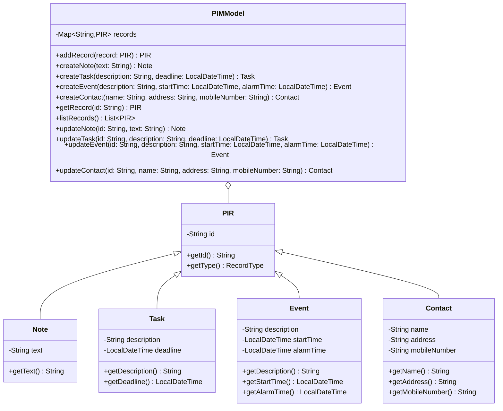

# A Core Design Contribution

This document describes the implemented Java PIR model for US1-US6. It can be
merged into the group's design document. Search, persistence, and CLI code
should use the public API without accessing the collection's internal map.

## Structure

All four PIR classes are immutable. `PIMModel` assigns a stable UUID string to
each newly created PIR and stores PIRs in insertion order. Each update checks
the existing type, constructs a replacement with the same ID, and commits it
only after validation succeeds. Updating one field through the CLI means
passing the unchanged values of the remaining fields to the typed update
method.

## Public methods and exceptions

| Method signature | Return | Possible model exceptions |
|---|---|---|
| `PIMModel(Collection<? extends PIR> initialRecords)` | `PIMModel` | `InvalidRecordException`, `DuplicateRecordException` |
| `addRecord(PIR record)` | `PIR` | `InvalidRecordException`, `DuplicateRecordException` |
| `createNote(String text)` | `Note` | `InvalidRecordException` |
| `createTask(String description, LocalDateTime deadline)` | `Task` | `InvalidRecordException` |
| `createEvent(String description, LocalDateTime startTime, LocalDateTime alarmTime)` | `Event` | `InvalidRecordException` |
| `createContact(String name, String address, String mobileNumber)` | `Contact` | `InvalidRecordException` |
| `getRecord(String id)` | `PIR` | `RecordNotFoundException` |
| `listRecords()` | `List<PIR>` | none; returns an immutable snapshot |
| `updateNote(String id, String text)` | `Note` | `RecordNotFoundException`, `InvalidRecordException` |
| `updateTask(String id, String description, LocalDateTime deadline)` | `Task` | `RecordNotFoundException`, `InvalidRecordException` |
| `updateEvent(String id, String description, LocalDateTime startTime, LocalDateTime alarmTime)` | `Event` | `RecordNotFoundException`, `InvalidRecordException` |
| `updateContact(String id, String name, String address, String mobileNumber)` | `Contact` | `RecordNotFoundException`, `InvalidRecordException` |

All required text fields must be nonblank; time fields must be non-null
`LocalDateTime` values. `LocalDateTime` carries no timezone. The CLI and search
module should agree on one date/time input format. The model does not impose
alarm-before-start ordering because Appendix B does not specify it.

## Integration contract

- **B Search:** use `listRecords()`, `getType()`, and type-specific getters.
  Search logic belongs in the `model` package.
- **C Operations and Persistence:** use `getRecord()` for one record and
  `listRecords()` for all records or serialization. Decode `.pim` data into
  `Note`, `Task`, `Event`, or `Contact`, then call
  `new PIMModel(decodedRecords)`. Add a deletion method to `PIMModel` for US9.
- **D CLI:** parse commands and date/time strings into `LocalDateTime`, call
  model methods, and format returned records. Catch model exceptions at the
  controller boundary and show readable errors.

## Verification

Run `./run_tests.ps1` from the project root on Windows. The script compiles
Java 8 compatible classes and runs six automatically executable unit tests.
The tests exercise creation of all four types, required-field validation,
updates, atomic rejection of invalid updates, imported IDs, duplicate IDs,
immutable snapshots, and missing-record errors.
